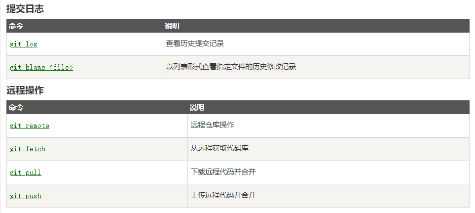

一、Git 区别于其他版本控制系统。

（一）它是分布式的

（二）内容按元数据方式存储

（三）git 分支是独立的

二、git 一般工作流程如下：

三、常用 git 指令

（一）git clone 仓库名 ：拷贝相应库

（二）配置 git 相关信息使用 git config

例：1. git config --(global)user.name "xxx"

2.git config --(global)user.email "xxx"

(三)删除分支
1.git branch 列出本地分支； git checkout branchname 切换分支

2.git branch -d branchname 删除分支

3.修改合并分支 git checkout branchname1;git rebase master(rebase 会将 master 上的修改合并到 branchname1 上)

四、git 基本操作

hit
